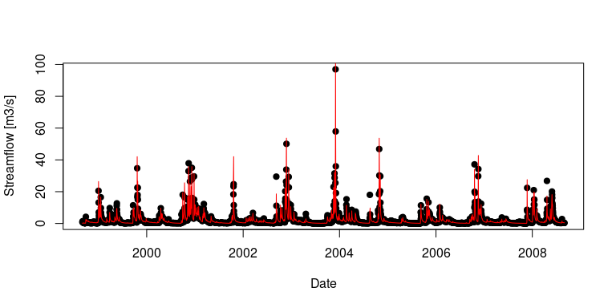
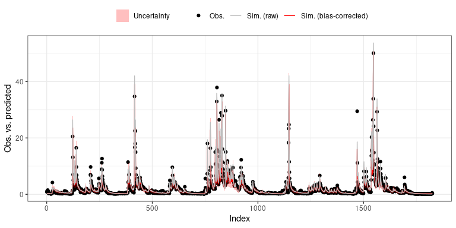
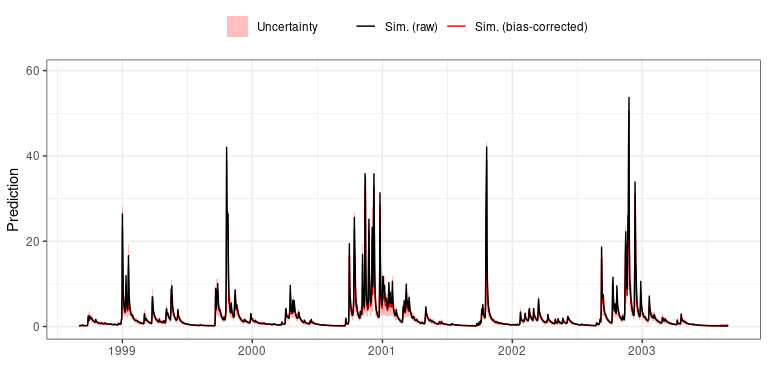
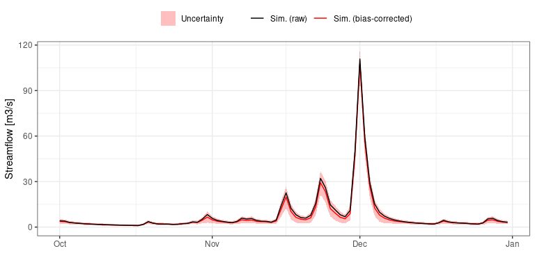
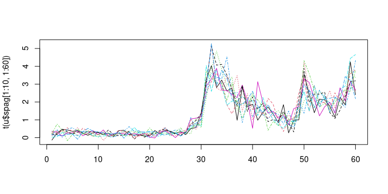

# REHAB - A R package to estimate predictive uncertainty by analysing REsidual Heteroscedasticity, Autocorrelation and Bias

## Introduction

The primary objective of `REHAB` if to estimate the total predictive
uncertainty around a streamflow time series simulated by an hydrological
model. This is achieved by analyzing the residuals (observed minus
simulated values), and in particular:

1.  their conditional bias, i.e. how the mean of residuals evolves as a
    function of the simulated streamflow (or some other predictors);
2.  their heteroscedasticity, i.e. how the standard deviation of
    residuals evolves as a function of the simulated streamflow (or some
    other predictors);
3.  their autocorrelation, i.e. how the lag-1 autocorrelation
    coefficient evolves as a function of the simulated streamflow
    gradient (or some other predictors).

## Installation

`REHAB` is not yet released on [CRAN](https://cran.r-project.org/), so
the development version from
[Github](https://github.com/BenRenard/REHAB) needs to be installed as
follows:

``` r
devtools::install_github('BenRenard/REHAB')
```

The package can then be loaded with:

``` r
library(REHAB) 
```

## Basic Usage

To demonstrate the use of `REHAB`, we will use the `ArdecheRiver`
dataset shipped with the package, which contains 10 years of observed
and simulated daily streamflow as illustrated below. Simulated
streamflows are from the [GR4J hydrological
model](https://webgr.inrae.fr/eng/tools/hydrological-models/daily-hydrological-model-gr4j),
available through the [airGR package](https://hydrogr.github.io/airGR/).

``` r
# Observed streamflow in black, simulated streamflow in red
plot(ArdecheRiver$date,ArdecheRiver$obs,xlab='Date',ylab='Streamflow [m3/s]',pch=19)
lines(ArdecheRiver$date,ArdecheRiver$sim,col='red')
```

<!-- -->

The first step is to call the function `analyseResiduals`, which
performs residual analysis and returns an object containing a whole
bunch of information that will be detailed a bit later.

``` r
# Perform residual analysis on the first 5 years (1826 days)
res=analyseResiduals(ArdecheRiver$obs[1:1826],ArdecheRiver$sim[1:1826])
# Plotting the object will show an obs. vs. sim plot
plot(res)
```

<!-- -->

To compute predictive uncertainty, the object `res` needs to be passed
to the function `getUncertainty`.

``` r
# Compute uncertainty
u=getUncertainty(res)
# Plot it
plot(u,axisValues=ArdecheRiver$date[1:1826])
```

<!-- -->

Note that by default, uncertainty is estimated around the simulated
streamflow used for residual analysis in step one. It is possible to
compute uncertainty around other simulated values, by simply passing
them with the `sim=` argument.

``` r
# Get uncertainty around simulated streamflow during the last 5 years
u=getUncertainty(res,sim=ArdecheRiver$sim[1827:3653])
# plot it
g=plot(u,axisValues=ArdecheRiver$date[1827:3653])
# Note that the returned plot is a ggplot2 object which can be further customized using ggplot2 utilities
g+ggplot2::xlim(as.Date('2003-10-01'),as.Date('2003-12-31'))+ggplot2::labs(y='Streamflow [m3/s]')
```

<!-- -->

The object `u` returned by the `getUncertainty` is a list containing a
bunch of information, in particular:

- `u$env` contains the uncertainty envelop and the predictive median

``` r
head(u$env)
```

    ##      median          low      high
    ## 1 0.2166274 -0.023809399 0.4672223
    ## 2 0.2321779 -0.038635722 0.4923878
    ## 3 0.2225946 -0.039493768 0.4910439
    ## 4 0.2257272 -0.022402258 0.4836795
    ## 5 0.2349121 -0.023699273 0.4926910
    ## 6 0.2205452 -0.008669643 0.4786937

- `u$spag` contains streamflow spaghettis, i.e. 1000 possible
  realizations of the streamflow time series, representing predictive
  uncertainty.

``` r
# Plot 10 spaghettis during the first 60 days
matplot(t(u$spag[1:10,1:60]),type='l')
```

<!-- -->

## Advanced Usage

Under the hood, `REHAB` performs polynomial regressions for the mean,
the standard deviation and the lag-1 autocorrelation of residuals. The
example below shows a few useful options to manipulate these
regressions.
